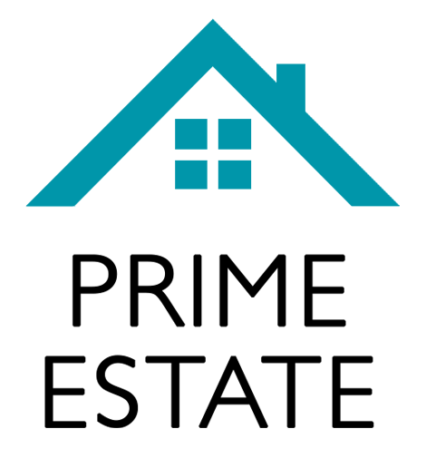
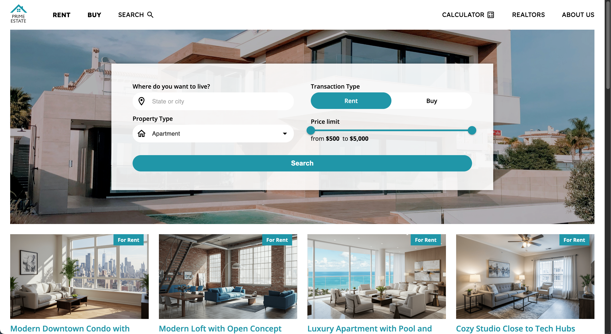
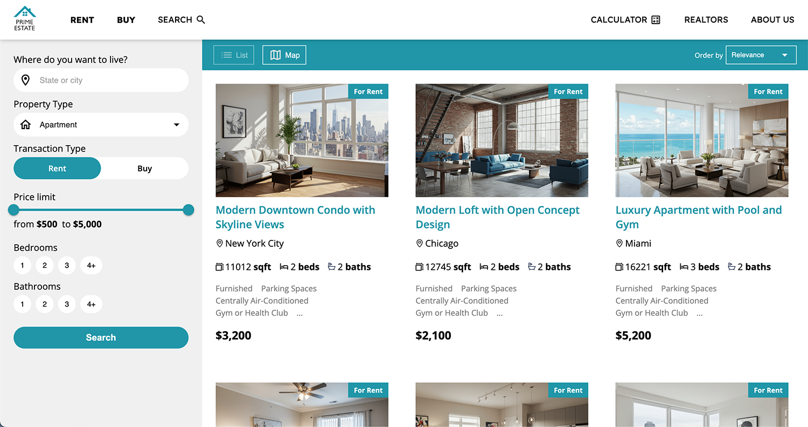
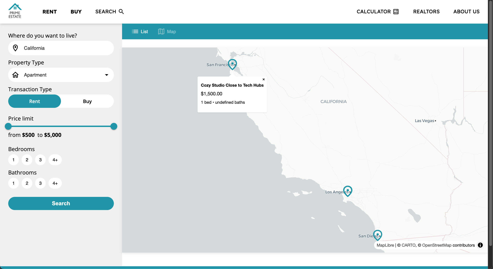
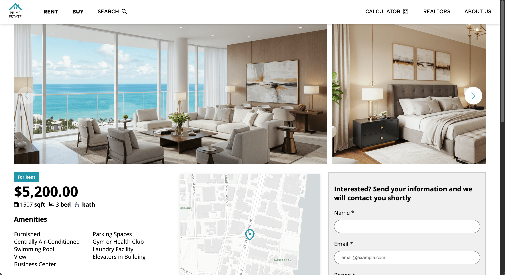
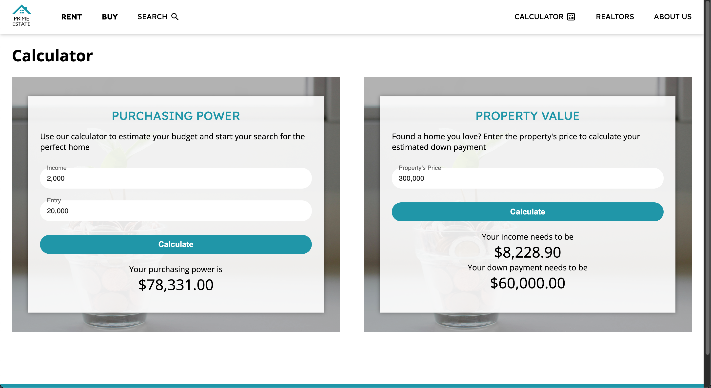
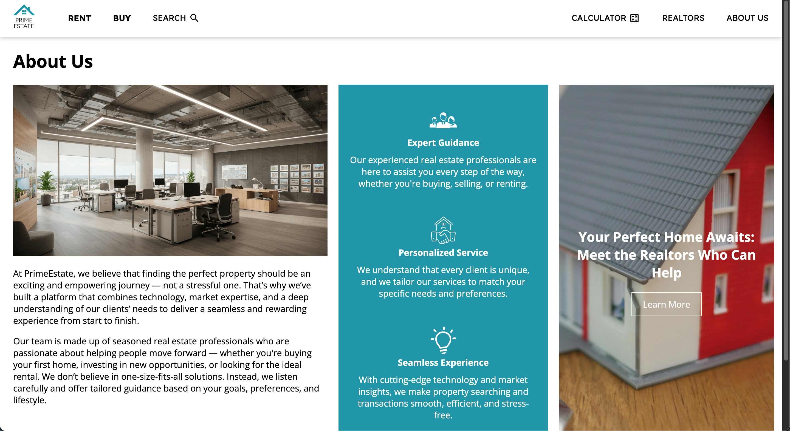

<div align="center">
  <a href="https://projects.andressabertolini.com/prime-estate/" target="_blank" rel="noopener noreferrer">
  
  </a>

  <h2>Prime Estate</h2>

  **Prime Estate** is a real estate platform for searching properties

  <a href="https://projects.andressabertolini.com/prime-estate/" target="_blank" rel="noopener noreferrer">
    
  </a>
</div>

## ✨ Features

<table>
  <!------------------------------------------------------------->
  <tr>
    <td width="45%">

  - Property search with filters (simplified version for better usability)
  - Property recommendations for rent or purchase
  - CTAs for the mortgage calculator, real estate agents, and company information

    </td>

    <td width="55%">
      <a href="https://projects.andressabertolini.com/prime-estate/" target="_blank" rel="noopener noreferrer">
        
      </a>
    </td>
  </tr>
  <!------------------------------------------------------------->
  <tr>
    <td width="45%">

  - Advanced property search with filters
  - Property search results with list and map views

    </td>

    <td width="55%">
      <a href="https://projects.andressabertolini.com/prime-estate/properties?query=California&purpose=rent&type=apartment&view=list" target="_blank" rel="noopener noreferrer">
      
      </a>
      <a href="https://projects.andressabertolini.com/prime-estate/properties?query=California&purpose=rent&type=apartment&view=map" target="_blank" rel="noopener noreferrer">
      
      </a>
    </td>
  </tr>
  <!------------------------------------------------------------->
  <tr>
    <td width="45%">

  - Property image gallery
  - Interactive map showing the property's location
  - Contact form to reach the real estate agent
  - Detailed property information
  - Related properties

    </td>

    <td width="55%">
    <a href="https://projects.andressabertolini.com/prime-estate/property/7" target="_blank" rel="noopener noreferrer">
      
    </a>
    </td>
  </tr>
  <!------------------------------------------------------------->
  <tr>
    <td width="45%">

  - Mortgage calculator with two modes: buying power and down payment/income simulation

    </td>

    <td width="55%">
      <a href="https://projects.andressabertolini.com/prime-estate/calculator" target="_blank" rel="noopener noreferrer">
      
    </a>
    </td>
  </tr>
  <!------------------------------------------------------------->
    <tr>
    <td width="45%">

  - Real estate agency information
  - Real estate agent profiles

    </td>

    <td width="55%">
    <a href="https://projects.andressabertolini.com/prime-estate/about-us" target="_blank" rel="noopener noreferrer">
      
    </a>
    <a href="https://projects.andressabertolini.com/prime-estate/realtors" target="_blank" rel="noopener noreferrer">
      
    </a>
    </td>
  </tr>
  <!------------------------------------------------------------->
</table>

<br>

## 🚀 Technologies

- React 19
- Vite
- Typescript
- React Router
- React Query
- Axios
- Context API

**Assets:**
- Images: AI generated by [Google Labs](https://labs.google/fx/tools/image-fx)
- APIs: Backend APIs are mocked using [MSW](https://mswjs.io/) for demonstration purposes 

<br>

## 🛠️ Installation

1. Clone the repository:

```bash
git clone https://github.com/andressabertolini/prime-estate.git
cd prime-estate
```

2. Install dependencies:
```
npm install
```

3. Create a .env file and add your API host (data is in /mock/properties.json):
```
VITE_MOCKAPI_HOST=your_host_here
```

4. Start the development server:
```
npm run dev 
```

The app will run at http://localhost:5173
